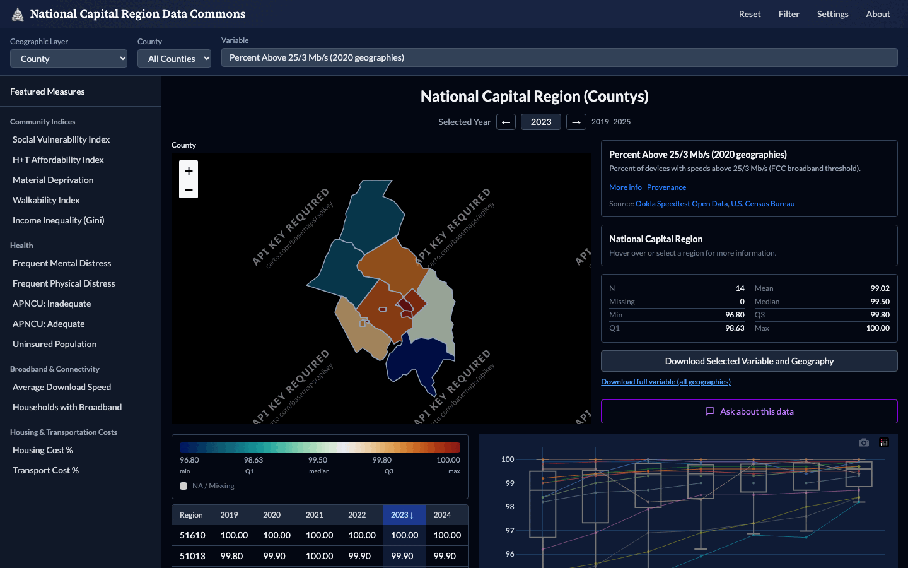
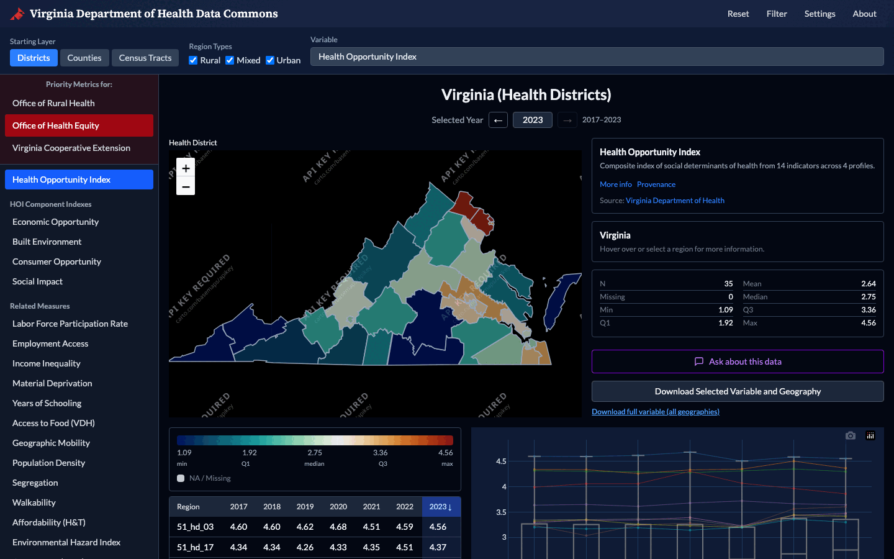

# Overview

The Social Data Commons supports equity-informed decision-making at the local
and regional level. It began as the Social Impact Data Commons, a project of
the Social and Decision Analytics Division of the Biocomplexity Institute at
the University of Virginia, and grew out of two sponsored projects that share
one community process, one pipeline codebase, and one dashboard design.

  <article class="sdc-project">
    
    <h3><a href="../dashboards/">Social Impact Data Commons to Inform Equitable Growth</a></h3>
    
Mastercard Center for Inclusive Growth · National Capital Region

    
Grounded in the questions of stakeholders in Arlington and Fairfax Counties: broadband equity, access to care, business diversity, and food security.

  </article>
  <article class="sdc-project">
    
    <h3><a href="../dashboards/">Data Commons to Support Department of Health Strategic Plans</a></h3>
    
Virginia Department of Health · State of Virginia

    
Priority measures for the Office of Rural Health, the Office of Health Equity, and Virginia Cooperative Extension, led by the Health Opportunity Index.

  </article>

## Objective

Most public data stop at the county. Local questions about broadband
affordability, access to care, or food insecurity play out at the
neighborhood level, so most of the work of the commons is producing
sub-county measures and placing them in the geographies local stakeholders
actually use. To make impactful, equity-informed decisions, decision-makers
need data and indicators that:

<ul class="sdc-swatch-list" markdown="0">
  <li><i style="--swatch:#7fd1b9"></i><b>Triangulate</b> on their policy challenges and questions.</li>
  <li><i style="--swatch:#2fa48e"></i>Sit at a <b>geographic level</b> that informs their decision-making.</li>
  <li><i style="--swatch:#1f6f8b"></i>Come in a <b>geographic shape</b> that is useful: a planning corridor, a school attendance zone, a civic association, a health district.</li>
  <li><i style="--swatch:#1d4f7a"></i>Are <b>validated and timely</b>.</li>
</ul>

## What a finished dataset must be

Once datasets are discovered, vetted, created, synthesized, and validated,
they must be easy to assess, access, and analyze. Everything is meant to be
both machine readable and human readable.

  <section class="sdc-block" style="--swatch:#7fd1b9">
    <h2>Assessable</h2>
    
<em>Are these the right data for the policy question?</em>

    
Maps, tables, charts, and full metadata for every measure on the dashboards, so a dataset can be judged before it is downloaded.

  </section>
  <section class="sdc-block" style="--swatch:#2fa48e">
    <h2>Accessible</h2>
    
<em>Can the data be downloaded?</em>

    
Direct download from the dashboards, and compressed CSV files with metadata committed to the public GitHub repository.

  </section>
  <section class="sdc-block" style="--swatch:#1f6f8b">
    <h2>Analyzable</h2>
    
<em>Can the data go straight into a user's own analysis?</em>

    
One long-format schema, standardized file names, and 2020 census geographies across every dataset.

  </section>

## What the commons provides

  <section class="sdc-block" style="--swatch:#7fd1b9">
    <h2>Two open-source dashboards</h2>
    
Lightweight static web applications that run on free hosting such as GitHub Pages. One for Virginia, one for the National Capital Region.

    <a class="sdc-block__link" href="../dashboards/">Dashboards</a>
  </section>
  <section class="sdc-block" style="--swatch:#2fa48e">
    <h2>Open data and pipelines</h2>
    
Broadband, business climate, demographics, education, environment, financial well-being, food, health, housing, public safety, and transportation. The code that ingests each source lives beside its output.

    <a class="sdc-block__link" href="../inventory/">Data inventory</a>
  </section>
  <section class="sdc-block" style="--swatch:#1f6f8b">
    <h2>Open-source tools</h2>
    
Published on PyPI: spatial access and availability metrics, redistribution of population data into alternate geographies, and 2010-to-2020 census boundary standardization.

    <a class="sdc-block__link" href="../packages/">Python packages</a>
  </section>
  <section class="sdc-block" style="--swatch:#1d4f7a">
    <h2>Data stories</h2>
    
Worked examples that apply the commons to real local issues, each triangulating several measures to answer one question.

    <a class="sdc-block__link" href="../stories/">Data stories</a>
  </section>

## Looking ahead

The commons is designed to be modular, sustainable, and expandable. Ongoing
work extends it into new policy areas and new geographies, creates new
policy-relevant indicators, and keeps existing datasets current as new source
data are released.

## Contact

Aaron Schroeder, Principal Investigator, [ads7fg@virginia.edu](mailto:ads7fg@virginia.edu)
