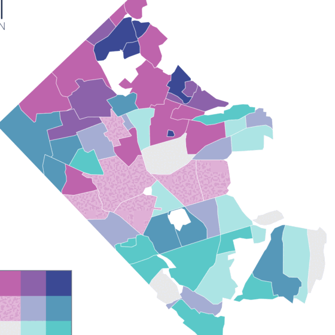

# Guides

Longer-form, step-by-step guides produced by the Social Data Commons. Each
one takes a method the commons relies on and walks through it with real data,
working code, and the judgement calls along the way, so that an analyst in
another jurisdiction can repeat it.

  <article class="sdc-story">
    
    

      <h2><a href="https://dads2busy.github.io/local-level-data-guide/">Creating Local-Level Geographic Datasets</a></h2>
      
A practical, illustrated guide for sub-county policy analysis · Aaron Schroeder · June 2026 · Published with the Mastercard Center for Inclusive Growth · CC BY 4.0

      <ul class="sdc-story__measures" aria-label="What the guide covers">
        <li><i style="--swatch:#7fd1b9"></i>Areal interpolation</li>
        <li><i style="--swatch:#2fa48e"></i>Parcel-based redistribution</li>
        <li><i style="--swatch:#1f6f8b"></i>Census block groups to civic associations</li>
        <li><i style="--swatch:#1d4f7a"></i>Python and R pipelines</li>
      </ul>
      
Local officials decide at the neighborhood level, but the data they get stops at the county. The guide shows how to move official statistics onto the boundaries people actually plan with, using Arlington County's broadband speed and household income redistributed to its 62 civic associations, then how to judge the uncertainty and apply the same pipeline anywhere.

      <ol class="sdc-chapters" aria-label="Chapters">
        <li><a href="https://dads2busy.github.io/local-level-data-guide/the-gap.html">The sub-county data gap</a></li>
        <li><a href="https://dads2busy.github.io/local-level-data-guide/01-boundary-problem.html">The problem of misaligned boundaries</a></li>
        <li><a href="https://dads2busy.github.io/local-level-data-guide/02-the-data.html">The data</a></li>
        <li><a href="https://dads2busy.github.io/local-level-data-guide/03-method.html">The core method: areal interpolation</a></li>
        <li><a href="https://dads2busy.github.io/local-level-data-guide/04-worked-example.html">Worked example: Arlington, step by step</a></li>
        <li><a href="https://dads2busy.github.io/local-level-data-guide/05-results.html">Results and interpretation</a></li>
        <li><a href="https://dads2busy.github.io/local-level-data-guide/parcel-approach.html">A second approach: parcel-based redistribution</a></li>
        <li><a href="https://dads2busy.github.io/local-level-data-guide/06-limitations.html">Limitations and uncertainty</a></li>
        <li><a href="https://dads2busy.github.io/local-level-data-guide/07-apply-it.html">Apply it to your own jurisdiction</a></li>
        <li class="sdc-chapters__appendix"><a href="https://dads2busy.github.io/local-level-data-guide/08-code.html">The complete pipeline code (Python)</a></li>
        <li class="sdc-chapters__appendix"><a href="https://dads2busy.github.io/local-level-data-guide/09-code-r.html">The complete pipeline code (R)</a></li>
        <li class="sdc-chapters__appendix"><a href="https://dads2busy.github.io/local-level-data-guide/references.html">References</a></li>
      </ol>
      
Cite as: Schroeder, A. (2026). <em>Creating Local-Level Geographic Datasets: A Practical, Illustrated Guide for Sub-County Policy Analysis</em>. Mastercard Center for Inclusive Growth. <a href="https://dads2busy.github.io/local-level-data-guide/">dads2busy.github.io/local-level-data-guide</a>

      <a class="sdc-story__link" href="https://dads2busy.github.io/local-level-data-guide/">Read the guide</a>
      · <a href="https://github.com/dads2busy/local-level-data-guide">Source and pipeline on GitHub</a>
    

  </article>

The methods in this guide are the ones behind the
[`sdc-redistribute`](../packages/sdc-redistribute/index.md) package and the
custom geographies on the
[National Capital Region dashboard](https://dads2busy.github.io/national_capital_region_data/).
