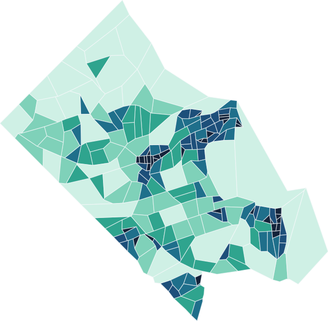

<div class="sdc-hero" markdown="0">
  <div>
    <h1>Neighborhood-level data for Virginia and the National Capital Region.</h1>
    <p>Sub-county measures of health, housing, income, food, broadband, and more, placed on 2020 census geographies and the local districts people actually plan with. Open data, open code.</p>
    <div class="sdc-hero__actions">
      <a class="md-button md-button--primary" href="dashboards/">Open the dashboards</a>
      <a class="md-button" href="inventory/">Browse the data inventory</a>
    </div>
  </div>
  <figure class="sdc-hero__map">
    <div class="sdc-legend" aria-hidden="true">
      <span style="background:#cff0e5"></span><span style="background:#7fd1b9"></span><span style="background:#2fa48e"></span><span style="background:#1f6f8b"></span><span style="background:#1d4f7a"></span><span style="background:#14233a"></span>
    </div>
    
    <figcaption>Arlington County's 204 census block groups, the smallest geography most measures reach.</figcaption>
  </figure>
</div>

<div class="sdc-counts" id="sdc-counts" markdown="0">
  <span><b id="c-measures">296</b> measures</span>
  <span><b id="c-geos">11</b> geographic levels</span>
  <span><b id="c-years">2009–2025</b></span>
  <span><b id="c-cats">16</b> topics</span>
  <span>previously the Social Impact Data Commons</span>
</div>

<div class="sdc-blocks" markdown="0">
  <section class="sdc-block" style="--swatch:#7fd1b9">
    <h2>Dashboards</h2>
    <p>Map any measure, step it through time, compare regions, and download exactly the slice you need. One dashboard for Virginia, one for the National Capital Region.</p>
    <a class="sdc-block__link" href="dashboards/">Open the dashboards</a>
  </section>
  <section class="sdc-block" style="--swatch:#2fa48e">
    <h2>Data stories</h2>
    <p>How several measures, read together, answer a real local question: broadband affordability, urgent care access, minority business ownership, food insecurity.</p>
    <a class="sdc-block__link" href="stories/">Read the stories</a>
  </section>
  <section class="sdc-block" style="--swatch:#1f6f8b">
    <h2>How datasets are built</h2>
    <p>The community process that decides what to measure, and the pipeline that turns raw sources into standardized, documented, versioned datasets.</p>
    <a class="sdc-block__link" href="about/approach/">Our approach</a>
  </section>
  <section class="sdc-block" style="--swatch:#1d4f7a">
    <h2>Python packages</h2>
    <p>The open-source tools behind the data: census geography standardization, value redistribution between geographies, and spatial accessibility.</p>
    <a class="sdc-block__link" href="#packages">See the packages</a>
  </section>
</div>

## What is a data commons?

A data commons is an open knowledge repository that co-locates data from a
variety of sources, builds and curates data insights, and provides tools
designed to track issues over time and geography. The Social Data Commons was
built by the Social and Decision Analytics Division of the Biocomplexity
Institute at the University of Virginia. It:

- provides data, indicators, indices, case studies, and training;
- analyzes the impact of social, economic, and health trends and major events;
- enables ongoing learning from data;
- addresses local issues of concern, such as food insecurity, health equity,
  and access to broadband.

## Packages

| Package | What it does | PyPI |
| --- | --- | --- |
| [`sdc-census10to20`](packages/sdc-census10to20/index.md) | Redistribute 2010–2019 census data onto 2020 boundaries. | [pypi.org](https://pypi.org/project/sdc-census10to20/) |
| [`sdc-redistribute`](packages/sdc-redistribute/index.md) | Redistribute values between geographies (area- and parcel-weighted). | [pypi.org](https://pypi.org/project/sdc-redistribute/) |
| [`sdc-catchment`](packages/sdc-catchment/index.md) | Floating catchment area spatial accessibility (2SFCA, E2SFCA, …). | [pypi.org](https://pypi.org/project/sdc-catchment/) |

```bash
# uv (recommended)
uv add sdc-census10to20

# pip
pip install sdc-census10to20
```

## Links

- Source and data: [github.com/dads2busy/Social-Data-Commons](https://github.com/dads2busy/Social-Data-Commons)
- Virginia dashboard: [dads2busy.github.io/virginia_public_health_data](https://dads2busy.github.io/virginia_public_health_data/)
- National Capital Region dashboard: [dads2busy.github.io/national_capital_region_data](https://dads2busy.github.io/national_capital_region_data/)

<script>
// Keep the counts strip in step with the generated inventory.
fetch("inventory/inventory.json").then((r) => r.json()).then((d) => {
  const parents = d.rows.filter((r) => !r.group);
  const geos = d.sites.reduce((n, s) => n + s.levels.length, 0);
  const lo = Math.min(...parents.map((r) => r.years[0]));
  const hi = Math.max(...parents.map((r) => r.years[1]));
  document.getElementById("c-measures").textContent = parents.length;
  document.getElementById("c-geos").textContent = geos;
  document.getElementById("c-years").textContent = lo + "–" + hi;
  document.getElementById("c-cats").textContent = d.categories.length;
}).catch(() => {});
</script>
