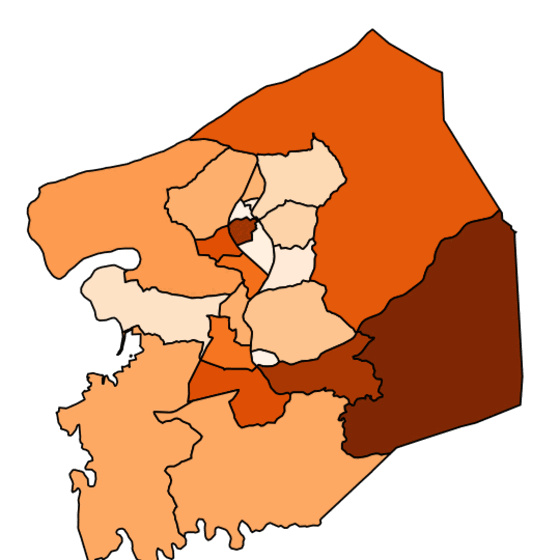
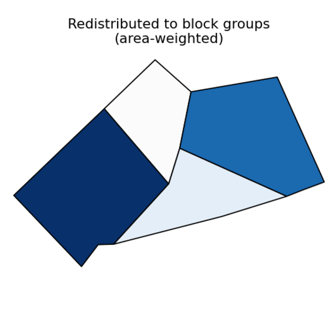
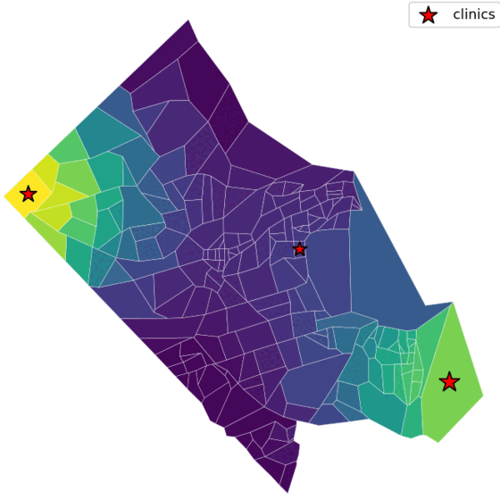

# Packages

The commons publishes the tools it builds its own datasets with. Three Python
packages, each a port of a Social and Decision Analytics Division R package,
cover the geographic work that comes up again and again in sub-county
analysis: putting old data on new boundaries, moving estimates into local
shapes, and turning facility locations into access scores. They share one
long-format data convention and are used by every pipeline in the
[repository](https://github.com/dads2busy/Social-Data-Commons).

```bash
uv add sdc-census10to20 sdc-redistribute sdc-catchment   # or: pip install …
```

<div class="sdc-stories" markdown="0">

  <article class="sdc-story">
    <a class="sdc-story__thumb" href="sdc-census10to20/" aria-hidden="true" tabindex="-1">
      
    </a>
    <div class="sdc-story__body">
      <h2><a href="sdc-census10to20/">sdc-census10to20</a></h2>
      <p class="sdc-guide__meta">Put 2010-to-2019 census data on 2020 boundaries · <a href="https://pypi.org/project/sdc-census10to20/">PyPI</a></p>
      <ul class="sdc-story__measures" aria-label="What it does">
        <li><i style="--swatch:#7fd1b9"></i>Classifies every tract and block group as same, split, or moved</li>
        <li><i style="--swatch:#2fa48e"></i>Area-weighted crosswalk that conserves counts</li>
        <li><i style="--swatch:#1f6f8b"></i>One call standardizes a whole dataset</li>
      </ul>
      <p class="sdc-story__finding">Census boundaries changed between the 2010 and 2020 censuses, so a time series that crosses that break compares different places. This package redistributes pre-2020 values onto the 2020 geography and gives every measure its <code>_geo20</code> variant, which is how the commons keeps 2009 and 2024 on the same map.</p>
      <a class="sdc-story__link" href="sdc-census10to20/">Overview</a>
      · <a href="sdc-census10to20/articles/introduction/">Introduction</a>
      · <a href="sdc-census10to20/reference/standardize_all/">Reference</a>
    </div>
  </article>

  <article class="sdc-story sdc-story--flip">
    <a class="sdc-story__thumb" href="sdc-redistribute/" aria-hidden="true" tabindex="-1">
      
    </a>
    <div class="sdc-story__body">
      <h2><a href="sdc-redistribute/">sdc-redistribute</a></h2>
      <p class="sdc-guide__meta">Move values between any two geographies · <a href="https://pypi.org/project/sdc-redistribute/">PyPI</a></p>
      <ul class="sdc-story__measures" aria-label="What it does">
        <li><i style="--swatch:#7fd1b9"></i>Area-weighted interpolation</li>
        <li><i style="--swatch:#2fa48e"></i>Parcel-weighted redistribution</li>
        <li><i style="--swatch:#1f6f8b"></i>Driven from a pipeline's config block</li>
      </ul>
      <p class="sdc-story__finding">Local decisions are made for civic associations, planning districts, and school zones, not census units. This package redistributes tract and block-group estimates into those shapes, by area overlap or, where parcel data exist, by where the housing actually is. It is the method behind the <a href="../guides/">local-level data guide</a> and the custom geographies on the NCR dashboard.</p>
      <a class="sdc-story__link" href="sdc-redistribute/">Overview</a>
      · <a href="sdc-redistribute/articles/introduction/">Introduction</a>
      · <a href="sdc-redistribute/articles/method-comparison/">Method comparison</a>
      · <a href="sdc-redistribute/reference/redistribute/">Reference</a>
    </div>
  </article>

  <article class="sdc-story">
    <a class="sdc-story__thumb" href="sdc-catchment/" aria-hidden="true" tabindex="-1">
      
    </a>
    <div class="sdc-story__body">
      <h2><a href="sdc-catchment/">sdc-catchment</a></h2>
      <p class="sdc-guide__meta">Floating catchment area access scores · <a href="https://pypi.org/project/sdc-catchment/">PyPI</a></p>
      <ul class="sdc-story__measures" aria-label="What it does">
        <li><i style="--swatch:#7fd1b9"></i>2SFCA, E2SFCA, 3SFCA, and more from one function</li>
        <li><i style="--swatch:#2fa48e"></i>Distance-decay kernels and travel-cost matrices</li>
        <li><i style="--swatch:#1f6f8b"></i>Supply, demand, and competition in one ratio</li>
      </ul>
      <p class="sdc-story__finding">Counting clinics in a tract says little about who can reach one. Floating catchment area methods weigh each facility's capacity against the population within reach of it, with nearer people counting for more. This package produces the urgent care, primary care, child care, and food access scores on both dashboards.</p>
      <a class="sdc-story__link" href="sdc-catchment/">Overview</a>
      · <a href="sdc-catchment/articles/introduction/">Introduction</a>
      · <a href="sdc-catchment/articles/case-study/">Case study</a>
      · <a href="sdc-catchment/reference/catchment/">Reference</a>
    </div>
  </article>

</div>

Each package ships with an introduction article that works through a real
county, a reference page generated from its docstrings, and a changelog on
PyPI. Issues and contributions go to the
[Social-Data-Commons repository](https://github.com/dads2busy/Social-Data-Commons/issues).
