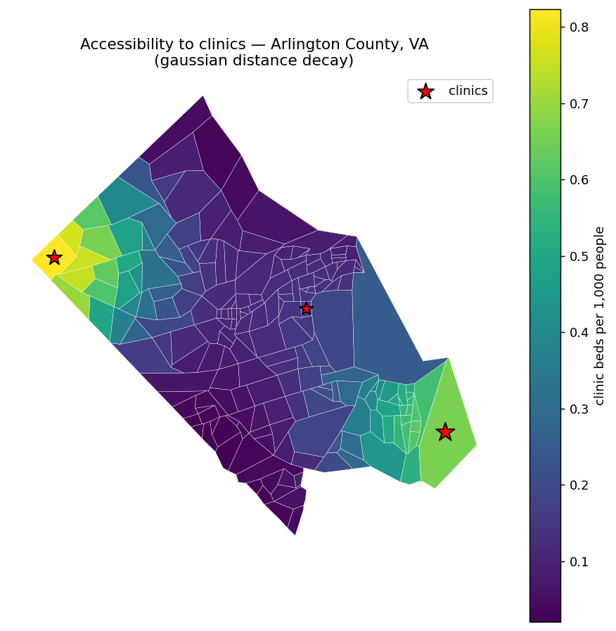

# Introduction to floating catchment areas

Floating catchment area (FCA) methods measure how much **supply** (clinics, jobs,
services) is accessible to each unit of **demand** (population), accounting for
the travel cost between them. `catchment_ratio` is the single entry point: you
give it consumer and provider tables, a travel-cost matrix, and a rule for how
cost turns into a weight — a hard distance bound, a decay kernel, or both. Every
FCA variant (2SFCA, E2SFCA, gravity, …) is a choice of those parameters.

## Setup

```bash
pip install sdc-catchment
```

```python
import numpy as np
import pandas as pd
from sdc_catchment import catchment_ratio, euclidean_cost
```

## A tiny catchment

Three equally-populated consumers sit in a line; two equal-capacity providers sit
at the ends. We build the travel-cost matrix from coordinates, then compute access
two ways.

```python
# 3 consumers (demand, value = population), 2 providers (supply, value = capacity).
consumers = pd.DataFrame({"geoid": ["c1", "c2", "c3"], "value": [100.0, 100.0, 100.0]})
providers = pd.DataFrame({"geoid": ["p1", "p2"], "value": [10.0, 10.0]})
consumers_xy = np.array([[0.0, 0.0], [1.0, 0.0], [2.0, 0.0]])
providers_xy = np.array([[0.0, 0.0], [2.0, 0.0]])
cost = euclidean_cost(consumers_xy, providers_xy)

# Binary catchment: everyone within max_cost=3.0 counts equally.
binary = catchment_ratio(consumers, providers, cost, max_cost=3.0)
# Distance-decay catchment: gaussian kernel.
decay = catchment_ratio(consumers, providers, cost, weight="gaussian", scale=1.0)

print("cost matrix:\n", cost)
print("\nbinary access:\n", binary.to_string())
print("\ngaussian-decay access:\n", decay.to_string())
```

```text
cost matrix:
 [[0. 2.]
 [1. 1.]
 [2. 0.]]

binary access:
 c1    0.066667
c2    0.066667
c3    0.066667

gaussian-decay access:
 c1    0.065179
c2    0.069641
c3    0.065179
```

With a generous binary bound, every consumer reaches both providers and receives
the region-wide supply-to-demand ratio — total supply 20 over total demand 300,
or about `0.0667` units of capacity per person. Switching to a **gaussian decay**
differentiates by distance: the central consumer `c2`, closest on average to both
providers, gets the highest access, and the two ends get slightly less.

Decay behaviour is set by the `weight` kernel and its `scale`. `KERNELS` provides
`linear`, `gaussian`, `gravity`, `exponential`, `logistic`, and `logarithmic`;
`max_cost` adds a hard travel bound on top of any kernel.

## On real geography

The same call scales straight to real data. Here every block group in Arlington
County, VA is a demand unit (located at its centroid), with three clinics placed
inside the county. The block-group geometries ship with this page as
`county_bgs.geojson`; we project to UTM 18N so distances are in meters.

```python
import numpy as np
import pandas as pd
import geopandas as gpd
from sdc_catchment import catchment_ratio, euclidean_cost

# Arlington County's 204 block groups (ships with this page), projected to meters.
bgs = gpd.read_file("county_bgs.geojson").to_crs(32618).reset_index(drop=True)
bgs["geoid"] = bgs["geoid"].astype(str)
cent = bgs.geometry.centroid
bg_xy = np.c_[cent.x.values, cent.y.values]

# Each block group is a demand unit with a synthetic population.
rng = np.random.default_rng(0)
consumers = pd.DataFrame({"geoid": bgs["geoid"], "value": rng.integers(500, 2500, len(bgs)).astype(float)})

# Three clinics inside the county (centroids of 3 evenly-spaced block groups).
idx = np.linspace(0, len(bgs) - 1, 3).astype(int)
clinics = pd.DataFrame({"geoid": ["A", "B", "C"], "value": [20.0, 15.0, 30.0]})
cost = euclidean_cost(bg_xy, bg_xy[idx])

access = catchment_ratio(consumers, clinics, cost, weight="gaussian", scale=2000.0, max_cost=8000.0)
beds_per_1000 = (access * 1000).round(3)
print(beds_per_1000.head().to_string())
```

```text
510131001001    0.823
510131001002    0.767
510131001003    0.663
510131001004    0.756
510131002001    0.614
```



*Each block group is shaded by clinic beds accessible per 1,000 residents; access
falls off with distance from the three clinics (stars). This is the same
`catchment_ratio` call as above, on 204 real block groups instead of three points.*

## See also

- [catchment reference](../reference/catchment.md)
- [Case study](case-study.md)
