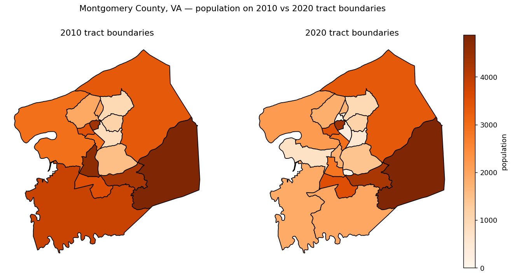

# Introduction

This article walks through the standard workflow: take a long-format dataset
covering years before and after the 2020 census, and produce a unified frame
where every pre-2020 sub-county measure exists in both its original 2010
boundary form (`_geo10` suffix) and a redistributed 2020 boundary form
(`_geo20` suffix).

## Input format

`standardize_all` expects an SDC long-format DataFrame:

| column        | type   | description                                  |
| ------------- | ------ | -------------------------------------------- |
| `geoid`       | str    | 11-char tract or 12-char block-group GEOID   |
| `year`        | int    | observation year                             |
| `measure`     | str    | measure name (e.g. `"material_deprivation"`) |
| `value`       | float  | measure value                                |
| `moe`         | float  | margin of error (may be `pd.NA`)             |
| `region_type` | str    | optional; `"tract"` or `"block_group"`       |

## Example

```python
import pandas as pd
from sdc_census10to20 import standardize_all

df = pd.DataFrame(
    {
        "geoid":   ["51059450100", "51059450200", "51059450100"],
        "year":    [2018,          2018,          2020         ],
        "measure": ["population",  "population",  "population" ],
        "value":   [3000.0,        4500.0,        3100.0       ],
        "moe":     [pd.NA,         pd.NA,         pd.NA        ],
        "region_type": ["tract",   "tract",       "tract"      ],
    }
)

standardized = standardize_all(df)
```

The 2018 rows are duplicated: once as `population_geo10` (original boundaries)
and once as `population_geo20` (redistributed onto 2020 boundaries). The 2020
row is emitted as `population_geo20` only.

## What "redistribute" actually does

For each pre-2020 row, `standardize_all` calls
[`convert_2010_to_2020_bounds`][sdc_census10to20.convert_2010_to_2020_bounds],
which:

1. Loads the Census 2010↔2020 relationship file for the appropriate resolution
   (tract or block group).
2. Classifies each row of the crosswalk as `same`, `split`, or `moved` based
   on counts and area overlap.
3. Distributes each 2010 tract's value to the overlapping 2020 tracts in
   proportion to the share of the **2010 source** area in each overlap
   (`area_part / area10`).

Because a source tract's overlaps tile it, the shares sum to 1 and the total is
**conserved** — a county's population is unchanged by reprojection onto 2020
boundaries (its county boundary didn't move). This is count-preserving areal
interpolation. For rates and indices, redistribute the numerator and denominator
separately and recompute the ratio at the 2020 level.

## Working with a single year/measure

If you have just one slice and want to redistribute it directly without the
suffix logic:

```python
from sdc_census10to20 import convert_2010_to_2020_bounds

slice_df = df[(df["year"] == 2018) & (df["measure"] == "population")]
on_2020_bounds = convert_2010_to_2020_bounds(slice_df)
```

The input must contain one row per GEOID; if you have multiple years or
measures, slice first or use `standardize_all`.

## Inspecting the crosswalk

To examine the underlying 2010↔2020 mapping:

```python
from sdc_census10to20 import get_2010_2020_bound_changes

cw = get_2010_2020_bound_changes(res="tract", geoids=["51059450100"])
print(cw)
```

`type_change` will tell you which case applies for each pairing.

## Visualizing a boundary change

`convert_2010_to_2020_bounds` redistributes a complete 2010-boundary dataset onto
2020 tract boundaries (area-weighted for tracts that were redrawn). Montgomery
County, VA had its tracts redrawn between 2010 and 2020 — 16 tracts became 23,
several splitting into smaller pieces — while the county boundary stayed put. Here
every 2010 tract gets a synthetic population, and we convert the whole county at
once. The tract geometries ship with this page.

```python
import geopandas as gpd
import numpy as np
import pandas as pd
from sdc_census10to20 import convert_2010_to_2020_bounds

tracts_2010 = gpd.read_file("tracts_2010.geojson").sort_values("geoid").reset_index(drop=True)

# Synthetic 2010 populations (one row per 2010 tract).
rng = np.random.default_rng(0)
data = pd.DataFrame({"geoid": tracts_2010["geoid"], "value": rng.integers(800, 5000, len(tracts_2010)).astype(float)})

# Convert the whole county onto 2020 boundaries (fetches the Census crosswalk).
out = convert_2010_to_2020_bounds(data, state_fips="51")
print("2010 total:", data["value"].sum(), " 2020 total:", round(out["value"].sum(), 1))
print(out.head().to_string(index=False))
```

```text
2010 total: 46688.0  2020 total: 46688.0
      geoid       value
51063920104   20.237667
51121020100 4372.473878
51121020201 3475.000000
51121020202 2946.373028
51121020301  126.482992
```



*The same 46,688 people, redistributed onto the redrawn 2020 tracts. The total is
**preserved** — each 2010 tract's count is split among the 2020 tracts that
replaced it in proportion to shared area, so a county's population is unchanged by
the reprojection. (A tiny amount lands in a neighboring county where a 2010 tract
straddled the county line — `51063920104` above.)*

> `convert_2010_to_2020_bounds` downloads the Census 2010↔2020 relationship file,
> so this example needs network access.

## See also

- [standardize_all reference](../reference/standardize_all.md)
- [convert_2010_to_2020_bounds reference](../reference/convert_2010_to_2020_bounds.md)
