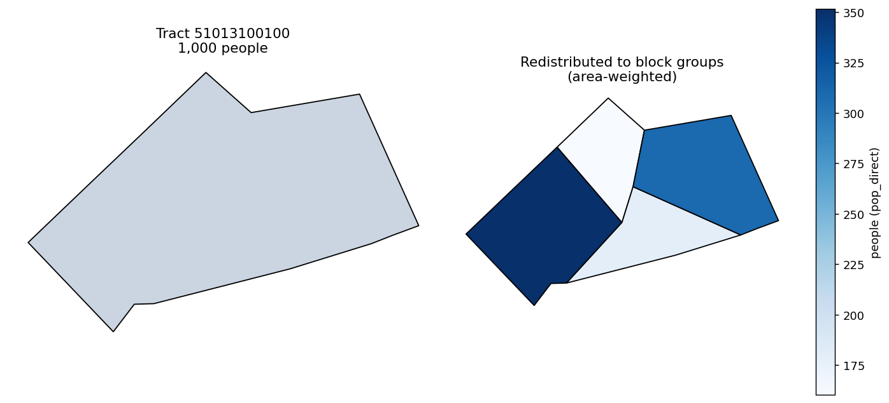

# Introduction

`sdc-redistribute` moves **count** measures from one set of geographies onto
another by areal interpolation — the area-weighted way to push a value recorded
for a larger unit (a census tract) down onto smaller units (block groups) that
partition it. This is the spatial analogue of the disaggregation example in the
R package: a value on a source frame is distributed across a target frame.

## Setup

```bash
pip install sdc-redistribute
```

```python
import tempfile, pathlib
import geopandas as gpd
import pandas as pd
from sdc_redistribute import redistribute_direct
```

## Redistributing a count

`redistribute_direct` takes long-format source data, a GeoJSON for the source
geometries, and a `{region_type: geojson}` mapping for each target geography.
Here we use a real census tract in Arlington County, VA (`51013100100`) and its
four 2020 block groups, shipped with this page as a small GeoJSON. We give the
tract 1,000 people and redistribute them down to the block groups.

```python
# tract_bgs.geojson ships with this article: the four block groups of tract 51013100100.
bgs = gpd.read_file("tract_bgs.geojson")
bgs["geoid"] = bgs["geoid"].astype(str)
tract_id = bgs["geoid"].str[:11].iloc[0]

# The tract is the union (dissolve) of its block groups.
tract = bgs.dissolve().assign(geoid=tract_id)[["geoid", "geometry"]]

# redistribute_direct reads GeoJSON paths, so write the geometries out.
tmp = pathlib.Path(tempfile.mkdtemp())
tract.to_file(tmp / "tract.geojson", driver="GeoJSON")
bgs[["geoid", "geometry"]].to_file(tmp / "bgs.geojson", driver="GeoJSON")

# 1,000 people recorded for the whole tract in 2020.
source_df = pd.DataFrame(
    {"geoid": [tract_id], "year": [2020], "measure": ["pop"], "value": [1000.0]}
)

out = redistribute_direct(
    source_df,
    source_geo=tmp / "tract.geojson",
    target_geos={"block_group": tmp / "bgs.geojson"},
    count_cols=["pop"],
)
print(out[["geoid", "measure", "value"]].to_string(index=False))
```

```text
       geoid    measure      value
510131001001 pop_direct 351.635089
510131001002 pop_direct 160.281519
510131001003 pop_direct 309.106123
510131001004 pop_direct 178.977268
```



*The tract's count is split across its block groups in proportion to each one's
share of the tract area — the largest block group receives the most people.*

The output is long-format, one row per target geoid, the values sum back to the
tract's 1,000, and the measure is suffixed `_direct` to record the method used.

Area-weighting assumes the count is spread evenly across the source geometry.
When that assumption is poor — population clusters in part of a tract — use
parcel-weighted redistribution instead (see the method comparison).

## See also

- [redistribute reference](../reference/redistribute.md)
- [Method comparison](method-comparison.md)
