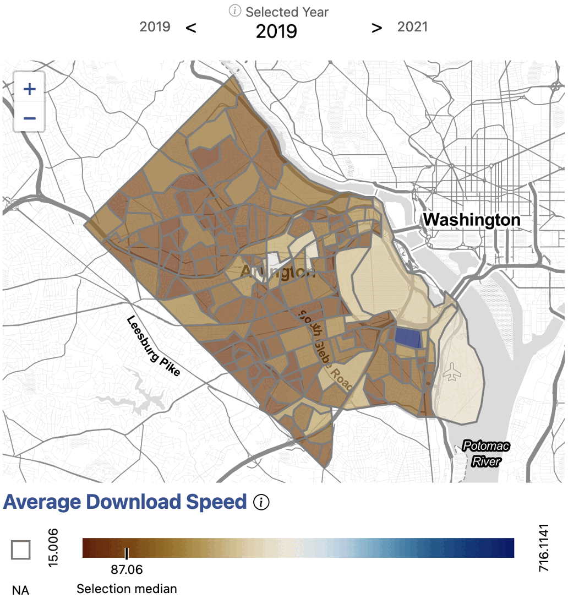
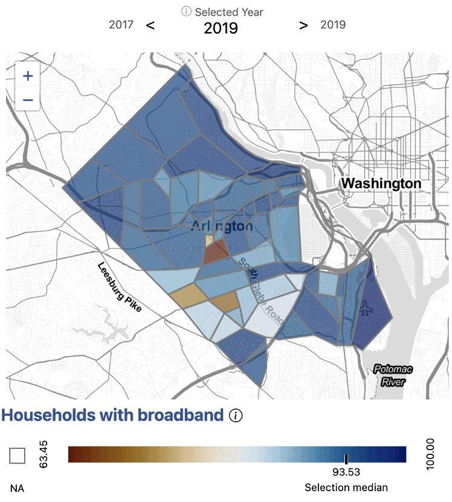
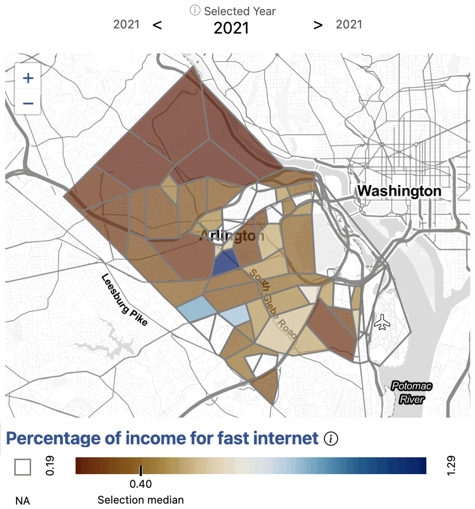
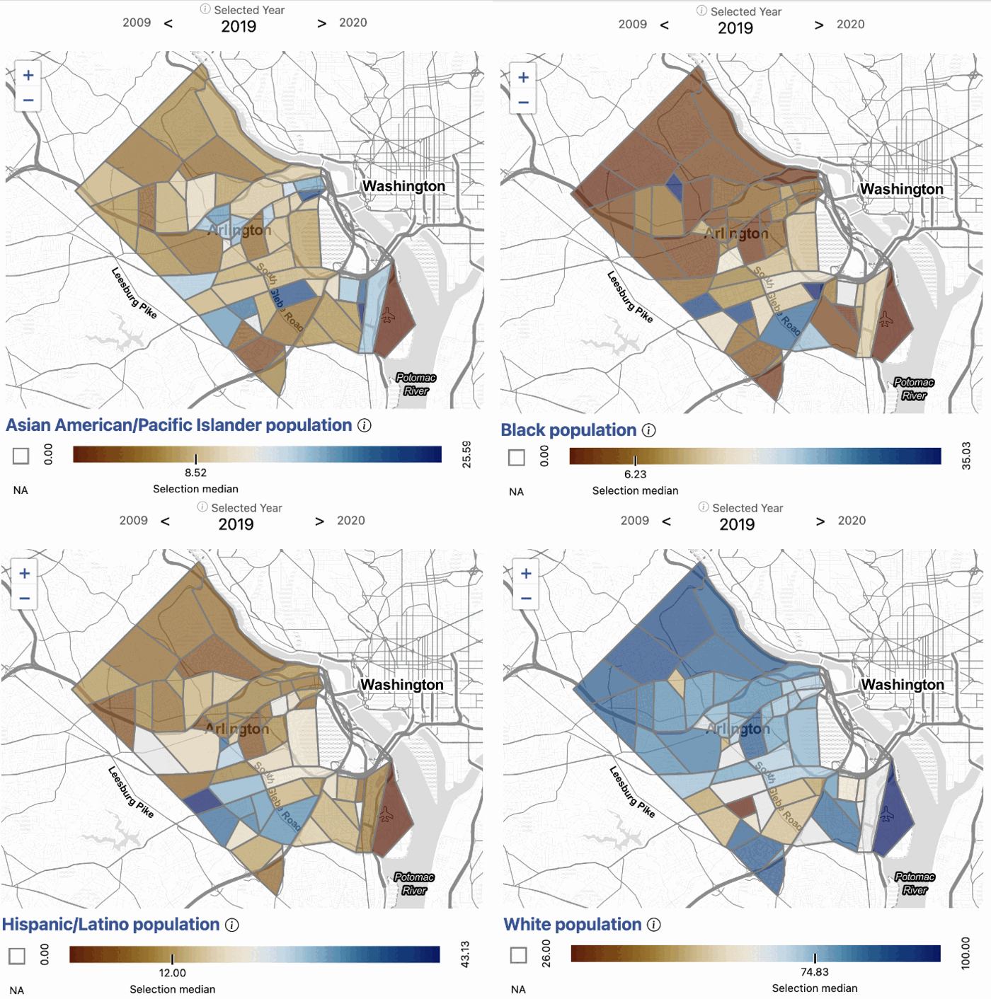
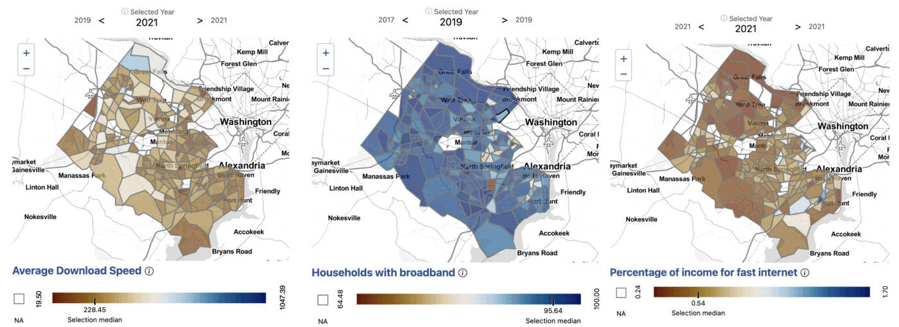

# Equity of access to broadband

**Multiple measures tell the story in Arlington and Fairfax Counties**

## Issue overview

Our stakeholders in Arlington County were interested in understanding the
nuances of access to broadband in their community. While anecdotal evidence
and existing data sources can tell us that high-speed Internet is not
accessible to everyone, there is not enough information at the sub-county
level to tell us where exactly the households in need are. Also, the
contributing factors for inaccessibility are not always obvious. Both of these
pieces of information are critical for local governments, such as Arlington
County, to develop effective policy to bridge the digital divide.

## What broadband infrastructure exists in Arlington?

**Exhibit 1. Average Internet download speeds in Arlington County by census
block group, 2019.**

*Data source: Ookla, accessed 2022.*

We began by examining Internet speeds in Arlington. We used information
provided by [Ookla](https://www.ookla.com/ookla-for-good/open-data), an
Internet speed test service. Ookla provides Internet speeds in 600-meter
squares, which we translated into census tracts and block groups. Exhibit 1
shows Internet speeds in Arlington by block group.

We saw that Internet speeds are relatively high across Arlington. Even the
slowest average download speeds were still above 100 Mb/s, which is the
standard for high-speed Internet or broadband.

From this, we understood that the infrastructure for broadband is highly
available in Arlington County.

## Who has adopted broadband?

**Exhibit 2. Households with a broadband Internet connection in Arlington
County by census block group, 2019.**

*Data source: American Community Survey, Table B28002, accessed 2021.*

Next, we wanted to understand the rates of broadband adoption across different
parts of Arlington County.

We used information from the
[American Community Survey](https://www.census.gov/programs-surveys/acs) to
analyze the percentage of households with broadband by census tract. Exhibit 2
shows the percentage of households in the county with a broadband Internet
connection.

From this, we saw that while broadband adoption was high overall throughout the
county, there remained some pockets of the county with noticeably lower rates.
Given the availability of broadband infrastructure in these areas, we sought to
better understand the contributing factors to their lower rates of adoption.

## Why isn't broadband accessible to everyone?

**Exhibit 3. Average price of fast Internet as a percentage of income in
Arlington County by census tract, 2021.**

*Data sources: American Community Survey, Table B19013, accessed 2022;
BroadbandNow, accessed 2021.*

We scraped [BroadbandNow](https://broadbandnow.com/), an aggregator of Internet
price packages, for information on the average cost of broadband in a given
area. We combined this Internet cost information with data from the American
Community Survey on average income. Given this, we were able to calculate the
cost of broadband as a percent of income in the county, shown in Exhibit 3.

We saw that the areas of lowest broadband adoption appear to directly correlate
with the areas having the highest ratio of household income to the cost of
broadband. This indicated that broadband accessibility is likely related to
economic affordability, rather than infrastructure, in Arlington County.

Knowing at a granular geographic level where households face difficulty
accessing high-speed Internet enables Arlington County stakeholders to make
better informed policy decisions regarding allocation of broadband resources,
as well as the types of resources offered.

## How does broadband access correlate with neighborhood demographics?

**Exhibit 4. Asian American/Pacific Islander (top left), Black (top right),
Hispanic/Latino (bottom left), and White (bottom right) population in
Arlington County by census tract, 2019.**

*Data source: American Community Survey, Table B01001, accessed 2021.*

When analyzing the relationship between demographics and access to broadband,
we see that neighborhoods with higher White populations tend to have greater
access to broadband. Exhibit 4 shows the percentage of selected racial and
ethnic demographic groups living in Arlington census tracts.

A higher than average population of Black, Hispanic/Latino, and Asian
American/Pacific Islander Arlingtonians live along Columbia Pike, where the
economic burden of broadband is generally highest in the county. Some of these
areas are historically Black neighborhoods, such as Green Valley and Johnson's
Hill.

For example, the census tract with the highest economic burden of broadband
has a White population of 59 percent (compared to the county average of 79), a
Black population of 16 percent (compared to the county average of 6), and a
Hispanic/Latino population of 23 percent (compared to the county average of
11).

Our analysis indicates that the economic burden of broadband is higher on
communities of color in Arlington.

## What does the story look like in Fairfax County?

Exhibit 5 shows the infrastructure, adoption, and cost measures for broadband
in Fairfax County. In Fairfax County, nearly all census tracts have an average
download speed above 100 Mb/s, indicating available and robust broadband
infrastructure. Yet there are pockets of low broadband adoption in the county
even in areas where high-speed Internet is available. We find that
neighborhoods with low broadband adoption correlate with high ratios of the
cost of broadband to income. This indicates that economic factors, as opposed
to available infrastructure, are likely drivers of low broadband adoption.

**Exhibit 5. Average Internet download speeds (left), percentage of
households with a broadband Internet connection (middle), and average price of
fast Internet as a percentage of income (right) in Fairfax County by census
tract, 2019–2021.**

*Data sources: Ookla; American Community Survey 2015/2019 Tables B28002 and
B19013; BroadbandNow; accessed 2023.*

In both Arlington and Fairfax Counties, the data show that the areas with the
lowest broadband adoption appear to demonstrate a higher proportion of income
being allocated toward broadband costs, indicating that broadband use is an
economic issue as opposed to one of availability.

## Impact

These analyses were presented to the Arlington County Board and the Fairfax
County Board of Supervisors and are directly informing the region's resource
planning.

## Explore the measures

Average download speed and households with broadband are available for every
county, tract, and block group in the region on the
[National Capital Region dashboard](https://dads2busy.github.io/national_capital_region_data/),
under *Broadband & Connectivity*.
