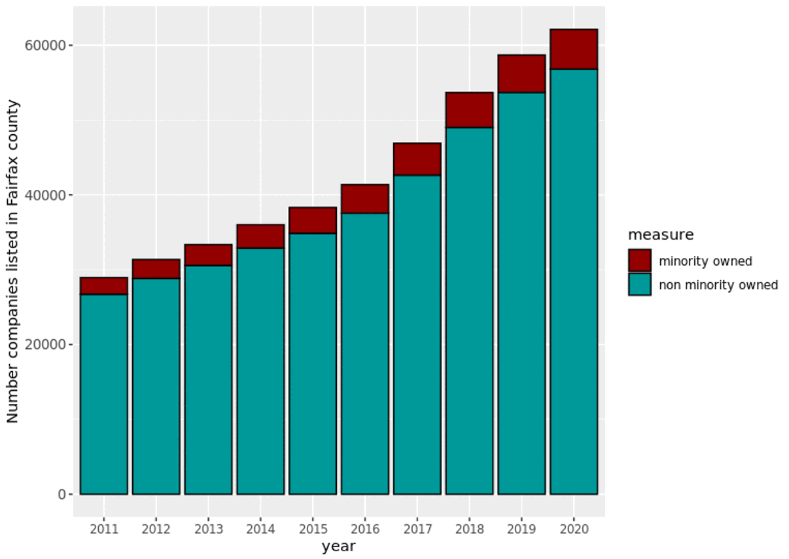
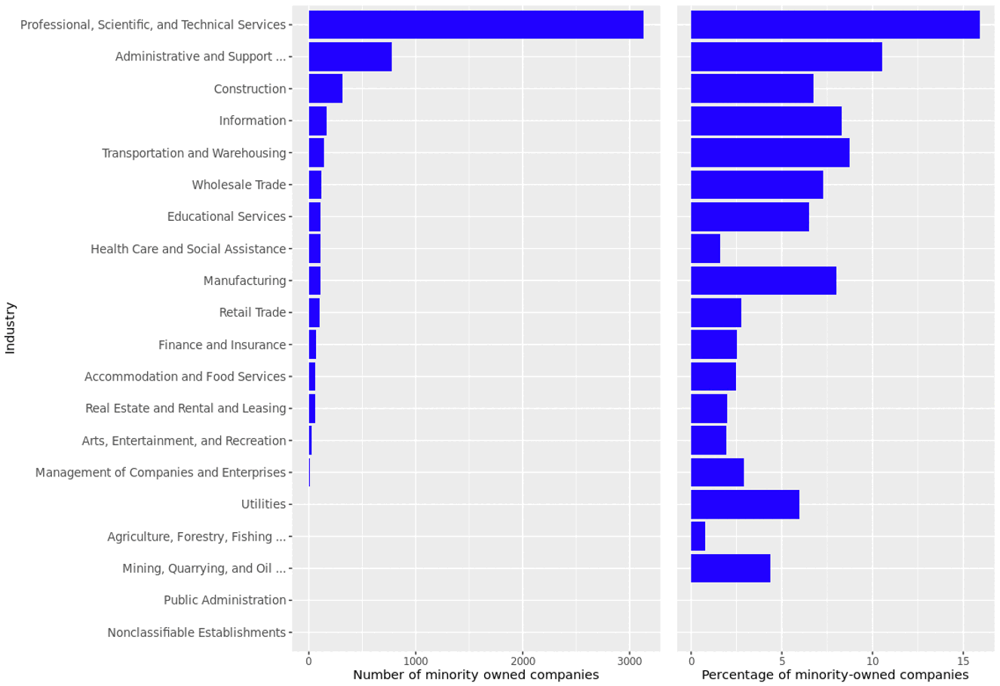
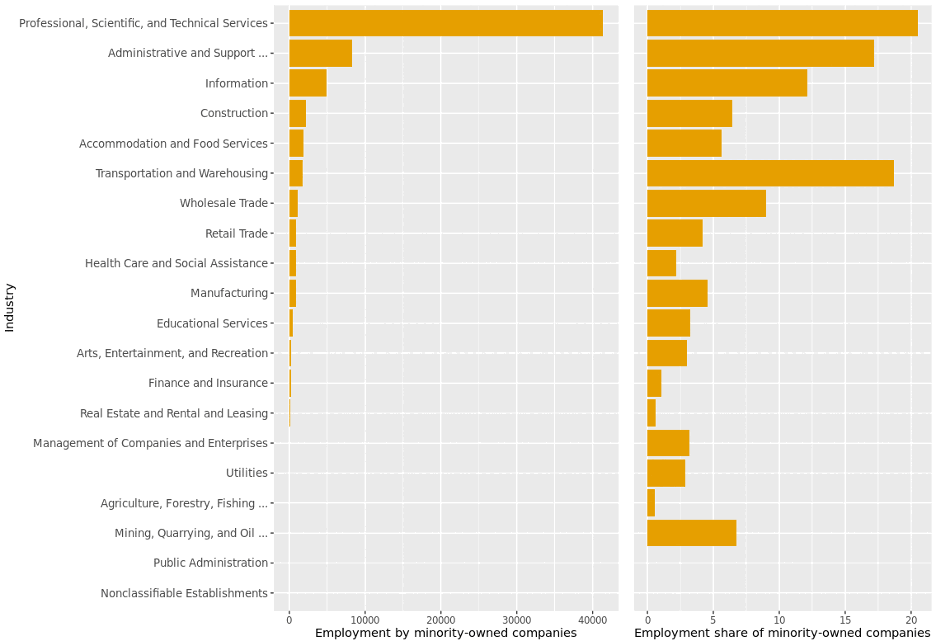
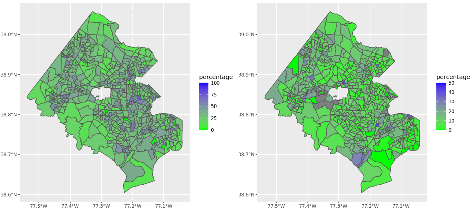
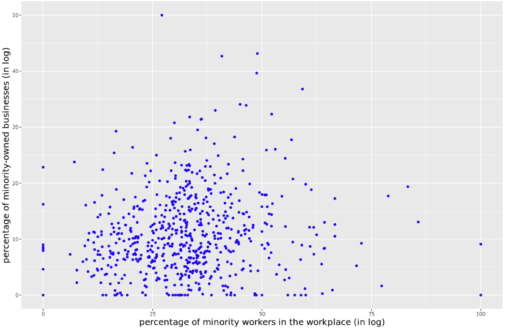

# Economic health and diversity

**What are the patterns in minority business ownership in Fairfax County?**

## Overview

Fairfax County stakeholders are interested in understanding economic health,
in particular economic diversity and minority business ownership.
Specifically, our stakeholders are interested in gaining an overview of
minority-owned business activity in the county. We also wanted to study the
relationship between minority business ownership and employment of
minorities. To investigate this topic, we began by discovering existing data
sources related to businesses.

## Data discovery

We found that Mergent Intellect, a data source licensed by the University of
Virginia Library, contained information on business locations and minority
ownership. To use these data to align with our stakeholders' questions, we
carefully examined the available metadata and data dictionaries. A
minority-owned business, as defined by the U.S. Small Business Administration
(SBA), must be majority (51%) owned by an individual or individuals belonging
to minority racial or ethnic (Hispanic) groups. Other designations by SBA,
such as women-owned and veteran-owned businesses, were not within the scope of
this investigation.

In our process of data discovery, we found a large discrepancy between the
composition of business ownership reported in Fairfax by the U.S. Census
Bureau Survey of Business Owners and the composition reported by Mergent
Intellect. As we discuss in next steps, we are investigating methods to bridge
this gap and efficiently use real-time opportunity data to investigate
minority business ownership.

For our investigation, we aimed to provide Fairfax County with a descriptive
overview of business activity by minority-owned businesses. To describe
business activity, we collected information related to industry and time.
Mergent Intellect provides the North American Industry Classification System
(NAICS) code for businesses, which is a standard for collecting and publishing
data related to the business economy. Mergent Intellect also reports the
founding year of a business, so we inferred its years of operation between
2011 and 2020. Given these data, we proposed metrics to describe industry
activity both cross-sectionally and over time.

## Overview of minority-owned businesses

Exhibit 1 presents data from Mergent Intellect to show the number of
businesses in Fairfax County between 2011 and 2020 by minority and
non-minority ownership.

Mergent Intellect data show that the number of companies in Fairfax County
grew 112% between 2011 and 2020. The number of minority-owned companies grew
138%. Minority-owned companies represent a small share of companies in Fairfax
County: 7% of total companies in 2011, growing to 8% in 2020.

**Exhibit 1. Number of companies in Fairfax County, by minority/non-minority
ownership, 2011–2020.**

*Data source: Mergent Intellect, accessed 2022.*

In Fairfax County, the top five industries by minority-owned business activity
in 2020 are listed below. The number in parentheses is the share of companies
in that industry that are minority owned.

- Professional, scientific (16%)
- Administrative and support (11%)
- Construction (7%)
- Information (8%)
- Transportation and warehousing (9%)

In 2020, minority-owned companies represented less than 20% of all companies
across all industries.

**Exhibit 2. Number and percentage of minority-owned businesses by industry in
Fairfax County, 2020.**

*Data source: Mergent Intellect, accessed 2022.*

The data from Mergent Intellect provide a general overview of minority-owned
business activity in Fairfax. The number of minority-owned businesses in the
county has grown roughly in proportion to business growth overall, and
minority-owned businesses do not exceed 20% of total ownership in any
industry.

## Minority business ownership and minority employment

Exhibit 3 shows overall trends for employment by minority-owned businesses
across all industries. Employment is concentrated in the industries with high
minority-owned business activity:

- Professional, scientific (21%)
- Administrative and support (17%)
- Construction (6%)
- Information (12%)
- Transportation and warehousing (19%)

The share of employment by minority-owned companies in each industry remains
below 23%. For all industries with high minority-owned business activity
except construction, the share of employment is above 10%.

**Exhibit 3. Number and percentage of employment by minority-owned businesses
in Fairfax County, 2020.**

*Data source: Mergent Intellect, accessed 2022.*

Our stakeholders were interested in the relationship between minority-owned
businesses and employment of minorities. The Longitudinal Employer-Household
Dynamics (LEHD) Origin-Destination Employment Statistics (LODES) provide data
on jobs by census block group broken down by race and ethnicity. We combined
these data with Mergent Intellect to investigate the spatial relationship
between minority-owned businesses and minority employment.

Exhibit 4 (left) shows the percentage of minority employees by census block
group in Fairfax County in 2019. Minority employment accounts for below 25%
of total employment in most block groups, with pockets of higher
concentration. Exhibit 4 (right) shows the percentage of minority-owned
businesses by block group in 2019. Minority ownership likewise accounts for
less than 20% of total ownership in most block groups, again with areas of
higher concentration.

**Exhibit 4. Percentage of minority employees (left) and percentage of
minority-owned businesses (right) by census block group in Fairfax County,
2019.**

*Data sources: LEHD Origin-Destination Employment Statistics (left); Mergent
Intellect, accessed 2022 (right).*

Exhibit 5 shows the relationship between the percentage of minority-owned
businesses and the percentage of minority workers in census block groups in
Fairfax County in 2019. We see no correlation between the presence of
minority-owned businesses and the presence of minority employees. We were
surprised by this finding, as we expected a positive relationship. A spatial
correlation between minority business ownership and minority employment can
mostly be explained by a higher concentration of businesses overall: more
minority businesses operate in block groups with high business activity in
general, and therefore higher employment overall, including minority
employment.

**Exhibit 5. The relationship between the percentage of minority-owned
businesses and the percentage of minority workers in census block groups in
Fairfax County, 2019.**

*Data sources: LEHD Origin-Destination Employment Statistics; Mergent
Intellect, accessed 2022.*

## Next steps

This analysis provides an early view of minority business ownership. We are
continuing to collaborate with our stakeholders in Fairfax County to
investigate the topic. The next steps include:

- continuing to validate our results using the U.S. Census Bureau Survey of
  Business Owners;
- leveraging real-time opportunity data and modeling techniques to measure
  minority business ownership more accurately;
- completing case studies to understand the business ownership and employment
  dynamics of specific industries or business corridors;
- creating more metrics for studying this topic, including business entry and
  exit rates, and job creation and destruction.
