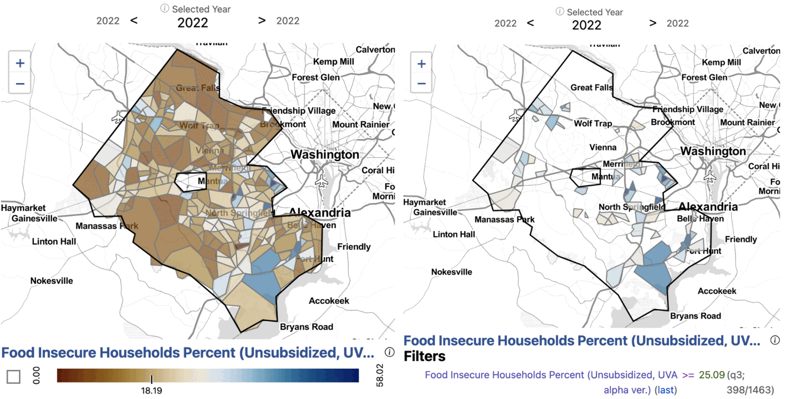
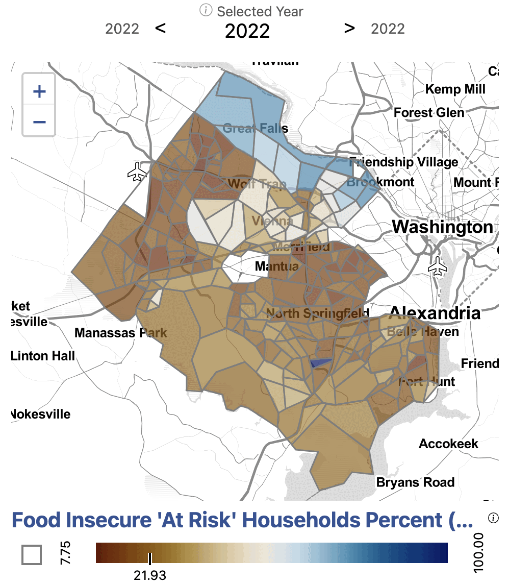
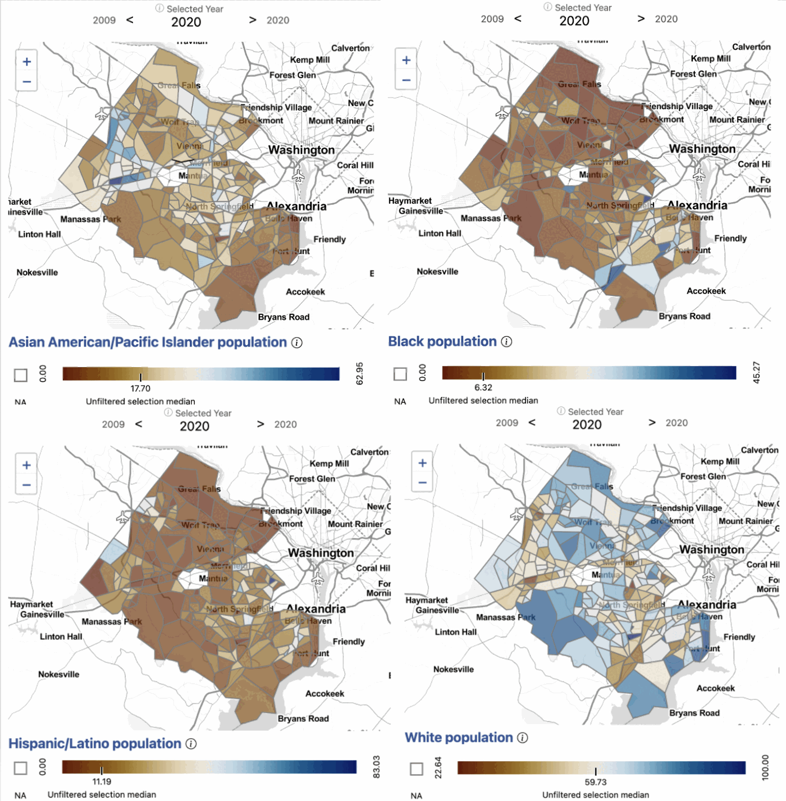

# Food insecurity

**How do we measure food insecurity in Fairfax County?**

## Issue overview

The current measure of food insecurity, the USDA Current Population Survey
Food Security Supplement, monitors food insecurity over time at national and
state levels. Our stakeholders, local governments and nonprofits, want food
insecurity measures at a smaller geographic level. Such knowledge would permit
local officials to better address the problem in identifiable small
geographies with targeted outreach and mitigation strategies, such as
nutrition education and social service referrals.

We accomplish this by modeling food insecurity as a function of household
income, size, composition, and the census tract where the household resides,
and categorize a household as food insecure, at risk of food insecurity, or
food secure using the cost of living as the threshold.

## Calculating local cost of living

We define the cost of living as the amount of income necessary to pay federal
and state income taxes and to meet a household's needs to function at a
modest yet adequate standard of living. We include "living" in our
designation to connect this to the "living wage" and to distinguish that the
cost of living is not set at a deprivation level. Instead, it is a budget that
could be used to define a living wage. We reviewed the following calculators
to build a sense of the existing solutions:

- The [Living Wage Calculator](https://livingwage.mit.edu/) from the
  Massachusetts Institute of Technology
- The [Family Budget Calculator](https://www.epi.org/resources/budget/) from
  the Economic Policy Institute
- The [Self-Sufficiency Standard](https://selfsufficiencystandard.org/) from
  the University of Washington's Center for Women's Welfare

We found that the available cost of living calculators did not meet our need
for detail at the sub-county level. To construct a sub-county cost of living,
we completed a data discovery to find available sources for budget categories
at a geographically granular level and replicable across the National Capital
Region. The basic needs include housing, food, transportation, healthcare,
childcare, broadband, and other necessities such as clothing, household
supplies, personal care, nonprescription medicine, and school supplies.

The household income standard estimates are a function of family size and
composition and where the family resides. They assume the total cost of each
need without government subsidies (such as public housing, Medicaid, or
childcare assistance) and without nonprofit or informal assistance from family
and friends (such as unpaid childcare by a relative, food from food banks, or
shared housing). A cost of living budget was calculated for every household
combination within a census tract.

## Approach to measuring food insecurity

To estimate food insecurity at the census tract level using the cost of
living as the threshold, we used household data at the Public Use Microdata
Area (PUMA) level and aggregated household income and size data at the census
tract level from the American Community Survey (ACS). Iterative proportional
fitting (IPF) was used to estimate the number of households in each
income-by-size category within a census tract, subject to constraints from
known and fixed marginal row and column totals.[^1] [^2] The marginal row and
column totals are household income (ACS Table S1901) and household size (ACS
Table B11016) at the census tract level. For each census tract the procedure
was:

1. fill the body of the table with starting values (seeds), which were
   adjusted iteratively to match the row and column marginal totals;
2. adjust the cells in each row by multiplying each cell by the ratio of the
   fixed row marginal to the actual row sum;
3. adjust the cells in each column by multiplying each cell by the ratio of
   the fixed column marginal to the actual column sum.

Iterations between steps 2 and 3 were performed until the stop criterion was
reached: either the difference between iterations was less than 10^-11^ or
the number of iterations reached 1,000. For example, the fitted table for
census tract 450100 contains 135 two-person households with an income in the
range $75,000 to $99,999. For Fairfax County, 274 two-way tables were
estimated, each with 45 cells. All computations were done using the R package
for multidimensional array fitting, `mipfp`.[^3]

A monthly cost of living midpoint was calculated for each household size by
income category (each cell in the census tract table). The midpoint was then
compared to the limits of the income category to classify all the households
within a cell as secure, insecure, or at risk. For each cell:

1. calculate the cell threshold by summing the seven components of the cost
   of living excluding food (transportation, healthcare, childcare, housing,
   broadband, other expenses, and taxes) for each household combination of a
   particular household size, and take the midpoint;
2. estimate the food budget range for a cell as the difference between the
   cell threshold and the lower end of the income category, and between the
   cell threshold and the upper end;
3. calculate the monthly food cost for the household size using the USDA
   monthly low-cost food plan;
4. compare the USDA monthly food cost to the food budget range. If the food
   cost is less than the lower end of the range, the household is food
   secure; if it is greater than the upper end, the household is food
   insecure; if it falls within the range, the household is at risk.

## Findings

**Exhibit 1. Estimated percentage of households that are food insecure in
Fairfax County by census tract.**

*Data sources: USDA; Feeding America; U.S. Department of Housing and Urban
Development; Center for Neighborhood Technology; Health Insurance
Marketplace; Department of Labor Women's Bureau; BroadbandNow; National
Academy of Sciences; National Bureau of Economic Research TAXSIM version 35.
All accessed 2022.*

Applying our methodology, we can explore food insecurity at the census tract
level in Fairfax County. We find that the estimated percentage of households
facing food insecurity in Fairfax is 20 percent. This estimate is within the
margin of error of the food insecurity estimate from the survey conducted by
the National Opinion Research Center at the University of Chicago in 2022 for
the Capital Area Food Bank. Within the county, census tracts range from 0
percent to 58 percent food insecure.

Census tracts with the highest percentage of the population estimated to be
food insecure include southern Fairfax near Alexandria along Route 1, North
Springfield, Merrifield, along Leesburg Pike near southern Arlington, western
Fairfax near Dulles, and western Herndon.

**Exhibit 2. Estimated percentage of households at risk of food insecurity in
Fairfax County by census tract.**

*Data sources: as for Exhibit 1.*

Our methodology distinguishes households that are in an ambiguous position of
being food secure: they are at risk of food insecurity. Across Fairfax
overall, 26 percent of households are at risk of facing food insecurity.

## The demographics of food insecure neighborhoods

**Exhibit 3. Asian American/Pacific Islander (top left), Black (top right),
Hispanic/Latino (bottom left), and White (bottom right) population in Fairfax
County by census tract, 2019.**

*Data source: American Community Survey, Table B01001, accessed 2021.*

When we overlay patterns of food insecurity with demographics, we can see
patterns in the burden of food insecurity. Southern Fairfax near Alexandria
along Route 1, which is disproportionately food insecure, has a higher Black
population as well as a higher Hispanic/Latino population. Similarly, North
Springfield and Leesburg Pike near southern Arlington also have higher Black
and Hispanic/Latino populations. Merrifield, western Fairfax near Dulles, and
western Herndon, which experience higher than average food insecurity, have a
higher than average Asian American/Pacific Islander population.

Looking at the at-risk population, which is concentrated in Great Falls and
McLean, we see that these areas are made up of predominately White as well as
Asian American/Pacific Islander populations.

## Food insecurity with access to subsidies

Read more about the Supplemental Nutrition Assistance Program (SNAP) in
Fairfax County on the
[SNAP analysis page](https://dspg-young-scholars-program.github.io/fairfax-snap-app/background.html).

When we add SNAP access to our model, the percentage of households facing food
insecurity falls to 19 percent. The minimum percentage of food insecure
population in a census tract is 0 percent and the maximum is 55 percent. The
percentage of at-risk households has a mean of 16.7 percent across census
tracts, with a minimum of 16.7 percent and a maximum of 100 percent.

## Explore the measures

Food access and food assistance measures for the region are available on the
[National Capital Region dashboard](https://dads2busy.github.io/national_capital_region_data/),
and for Virginia on the
[Virginia dashboard](https://dads2busy.github.io/virginia_public_health_data/)
under *Access to Food*.

[^1]: Beckman, R. J., Baggerly, K. A., & McKay, M. D. (1996). Creating
    synthetic baseline populations. *Transportation Research Part A: Policy
    and Practice*, 30(6), 415–429.
[^2]: Deming, W. E., & Stephan, F. F. (1940). On a least squares adjustment of
    a sampled frequency table when the expected marginal totals are known.
    *The Annals of Mathematical Statistics*, 11(4), 427–444.
[^3]: Barthélemy, J., & Suesse, T. (2018). mipfp: An R Package for
    Multidimensional Array Fitting and Simulating Multivariate Bernoulli
    Distributions. *Journal of Statistical Software, Code Snippets*, 86(2),
    1–20. doi:10.18637/jss.v086.c02
