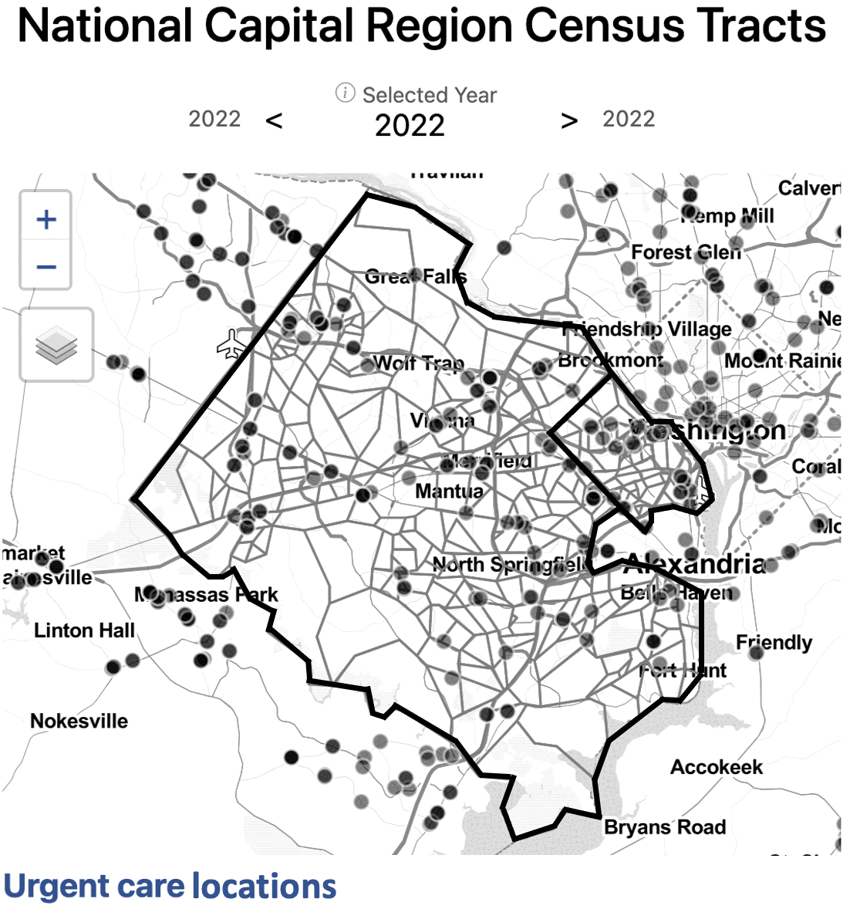
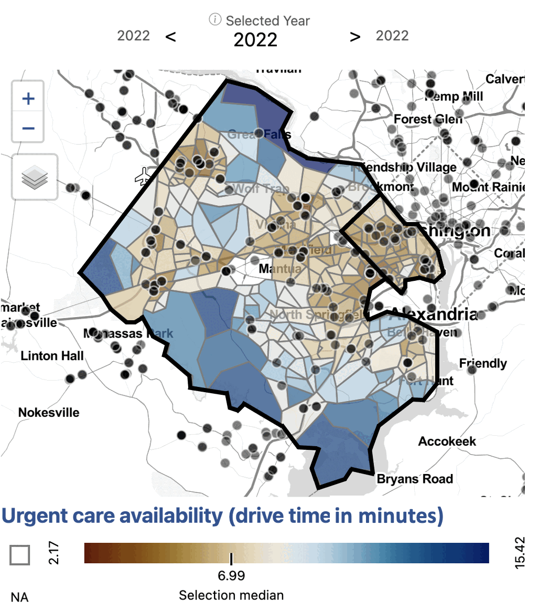
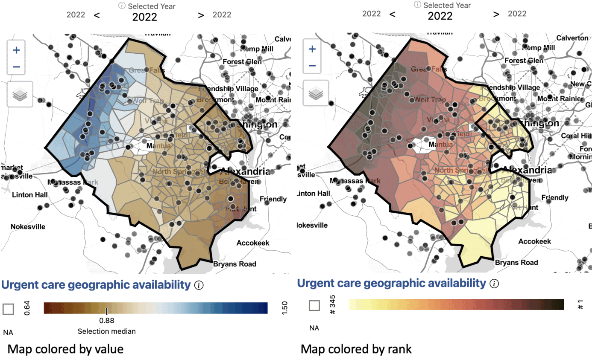
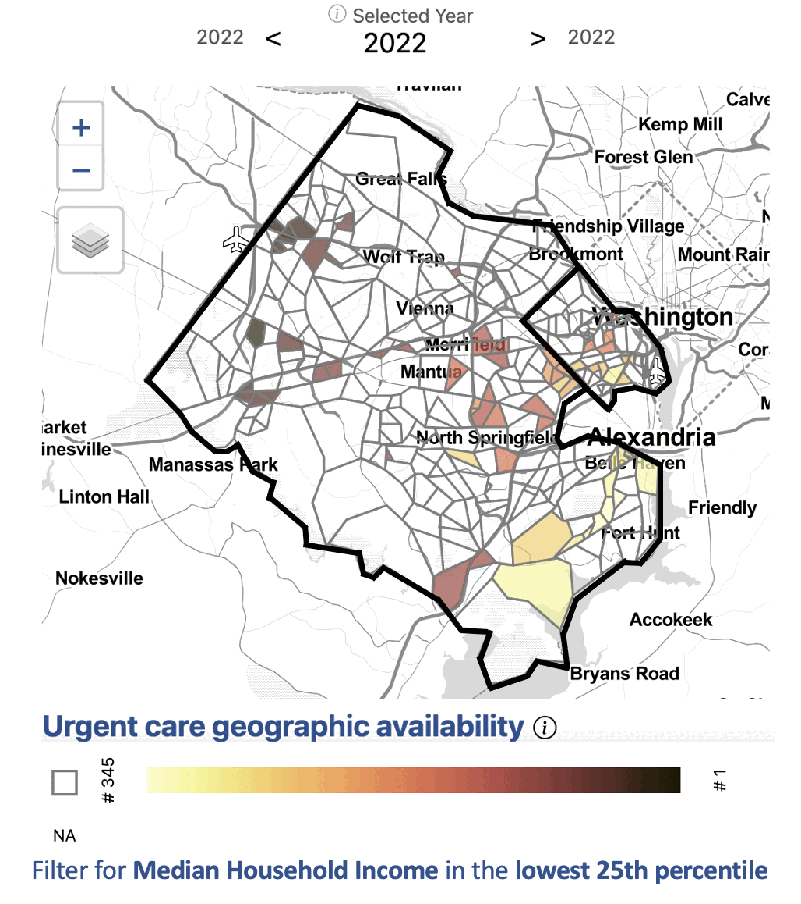
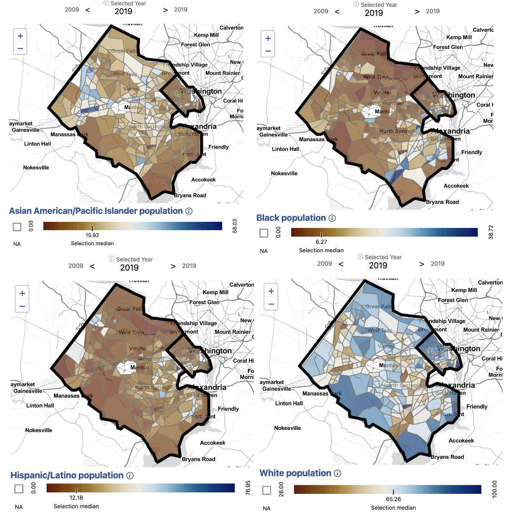

# Health equity in the National Capital Region

**Is access to urgent care health services equitable in Arlington and Fairfax
County?**

## Issue overview

Our partners in Arlington and Fairfax Counties were interested in
understanding the equity of access to health services by neighborhood, by race
and ethnicity, and by household income. We began by analyzing access to urgent
care health services facilities.

We inventoried a variety of urgent care location data sources for accuracy and
quality. Given that urgent care is a rapidly growing health care service, we
found that administrative datasets were incomplete. We found that
[Google Maps](https://maps.google.com/) provided the most complete picture of
urgent care locations in the National Capital Region. To get a better
understanding of the idea of access, we compared several measures.

## Where are urgent care health services in Arlington and Fairfax?

**Exhibit 1. Urgent care health services locations in Arlington and Fairfax
Counties by census tract, 2022.**



*Data source: Google Maps, accessed 2022.*

First, we examined the locations of urgent care facilities, shown in
Exhibit 1.

!!! quote ""
    **There are 113 urgent care health services facilities in Fairfax and 18
    in Arlington.**

By number of facilities, Fairfax has the greatest access to urgent care in the
National Capital Region. This would be expected given the Fairfax County
population is almost five times larger than Arlington County according to the
2020 Census. Fairfax County is also over 15 times larger by geographic area
than Arlington County. We also calculated presence of urgent care by census
tract. For most census tracts, there is no urgent care facility present.
Fairfax and Arlington residents who live in a census tract without an urgent
care facility may be able to easily drive to one nearby.

## How long does it take to drive to urgent care?

**Exhibit 2. Urgent care health services availability by drive time (minutes)
in Arlington and Fairfax Counties by census tract, 2022.**



*Data source: Google Maps, accessed 2022. Drive times calculated using Open
Source Routing Machine.*

The next measure of access we analyzed was drive time to the ten closest
urgent care facilities, shown in Exhibit 2. Here, we begin to see patterns of
access emerge.

!!! quote ""
    **Fairfax and Arlington residents who live in more urban areas, along
    major roads, or in Metro corridors have greater access to urgent care by
    drive time.**

In Fairfax, the range of drive time to the ten closest urgent care facilities
is three to over 15 minutes. Across Arlington, the range is two to nine
minutes. In both counties, geographic inequities exist in access to urgent
care. Our measure of access, though, still does not take into account any
population-level information.

## How do we develop a comprehensive measure of access?

**Exhibit 3. Value (left) and rank (right) of 3-step floating catchment areas
for urgent care health services access in Arlington and Fairfax Counties by
census tract, 2022.**



*Data source: Google Maps, accessed 2022. Population data from the American
Community Survey. Drive times calculated using Open Source Routing Machine.*

Next, we analyzed access to urgent care by geographic availability using
three-step floating catchment areas. A three-step floating catchment area
aggregates the ratio of urgent care facilities to population, weighted by
travel time. This provides a more complete picture of access in these
counties. (The method is implemented in the
[`sdc-catchment`](../packages/sdc-catchment/index.md) package.)

!!! quote ""
    **In Fairfax, the areas with the lowest access to urgent care are northern
    McLean and the southwestern neighborhoods, including Fort Hunt and
    Huntington.**

    **In Arlington, neighborhoods near Marymount University and southern
    neighborhoods below Columbia Pike have the lowest access.**

These areas have relatively high populations given the proximity of urgent
care. The area with the greatest access is Centreville, Chantilly, and
Herndon, which lie along major roads in western Fairfax and have a relatively
high number of urgent care facilities for the population. Bailey's Crossroads
and Annandale also have comparatively low access for the region.

**Exhibit 4. Rank of 3-step floating catchment areas for urgent care access,
filtered to census tracts in the lowest quartile of median household income,
Arlington and Fairfax Counties, 2022.**



*Data source: Google Maps, accessed 2022. Population data from the American
Community Survey. Drive times calculated using Open Source Routing Machine.*

Applying filters to the dataset can help us zero in on populations and
neighborhoods of interest. In this case, we filter for census tracts with a
median household income in the lowest 25th percentile (below $101,838). This
filter shows that some census tracts with low median household income are well
served by urgent care, particularly in western Fairfax near Centreville,
Chantilly, and Herndon.

!!! quote ""
    **Many census tracts, such as those in southern Arlington, Annandale,
    Bailey's Crossroads, and near Fort Hunt, have both a relatively low median
    household income and relatively low access to urgent care.**

## Is there inequity in access by demographics?

**Exhibit 5. Asian American/Pacific Islander (top left), Black (top right),
Hispanic/Latino (bottom left), and White (bottom right) population in
Arlington and Fairfax Counties by census tract, 2019.**



*Data source: American Community Survey, Table B01001, accessed 2021.*

After developing a comprehensive measure of access, we began to dig into the
question of equity of access to urgent care by demographics. We observed that
the neighborhoods affected by low access have different demographic
compositions.

Northern Arlington, where the population is largely White and high income on
average, has some of the lowest access to urgent care in the region.

Southern Arlington and the neighboring Bailey's Crossroads and Annandale in
Fairfax have higher Hispanic/Latino populations and lower income on average.
These areas also have relatively low access to urgent care.

Centreville, McLean, and Tysons Corner have larger Asian American/Pacific
Islander populations. Centreville has some of the highest access to urgent
care in the region, while McLean has some of the lowest.

Some census tracts in Huntington and Fort Hunt have higher than average Black
populations and lower than average household income. These areas are also the
most underserved in access to urgent care.

In addition to income and demographic variables, we could explore access by
additional factors affecting health equity, including primary language spoken
at home or access to health insurance.

Having a comprehensive knowledge of the equity of access to urgent care within
neighborhoods in Fairfax and Arlington empowers our local stakeholders to make
more effective policy decisions to address and correct inequities.

## Exploring access to additional health services

Using the commons, we can explore access to additional health services using
an equity lens. For example, we can explore differences in access to
hospitals, primary care physicians, or substance use facilities. We find that
access to these services across Fairfax and Arlington does not necessarily
follow the same pattern. Using specific measures, policymakers can make
informed decisions to address specific health equity gaps.

## Analyzing the data yourself

Every measure on the dashboards is also a compressed CSV in the
[Social-Data-Commons repository](https://github.com/dads2busy/Social-Data-Commons/tree/main/dashboard_data),
so an analysis like this one is a few lines of pandas. The example below reads
the urgent care access scores and the race and ethnicity shares for every
tract in the region, keeps Arlington and Fairfax, and correlates each group's
population share with the three-step floating catchment score.

```python
import pandas as pd

BASE = (
    "https://raw.githubusercontent.com/dads2busy/Social-Data-Commons/main/"
    "dashboard_data/national_capital_region_data/"
)
urgent = pd.read_csv(BASE + "ncr_tr_nppes_2020_2025_access_scores_urgent.csv.xz", dtype={"ID": str})
race = pd.read_csv(BASE + "ncr_tr_census_acs_2010_2024_race_demographics.csv.xz", dtype={"ID": str})

# Arlington (51013) and Fairfax (51059) census tracts in one year
year = 2023
df = urgent[urgent["time"] == year].merge(race[race["time"] == year], on=["ID", "time"])
df = df[df["ID"].str[:5].isin(["51013", "51059"])].copy()
df["county"] = df["ID"].str[:5].map({"51013": "Arlington", "51059": "Fairfax"})

groups = {
    "race_AAPI_percent_geo20": "Asian American / Pacific Islander",
    "race_afr_amer_alone_percent_geo20": "Black",
    "race_hispanic_or_latino_percent_geo20": "Hispanic or Latino",
    "race_wht_alone_percent_geo20": "White",
}

# Correlation between each group's population share and urgent care access (3SFCA)
corr = df.groupby("county").apply(
    lambda g: g[list(groups)].corrwith(g["urgent_3sfca"]), include_groups=False
)
print(corr.rename(columns=groups).round(2).T)
```

In the original analysis, urgent care access varied across census tracts in
Arlington without a clear relationship to demographics. In Fairfax, tracts
with higher Asian American/Pacific Islander populations tended to have higher
access, and tracts with higher Black and White populations tended to have
lower access. Running the example above against the current data lets you
check whether those patterns have held.

## Explore the measures

Urgent care access scores (facility count, drive time, and floating catchment
area) are available on the
[National Capital Region dashboard](https://dads2busy.github.io/national_capital_region_data/)
under *Health*.
