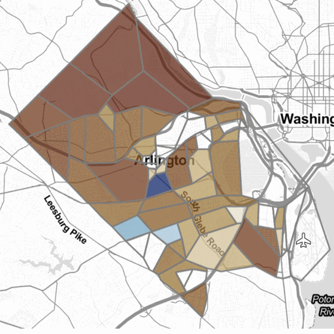
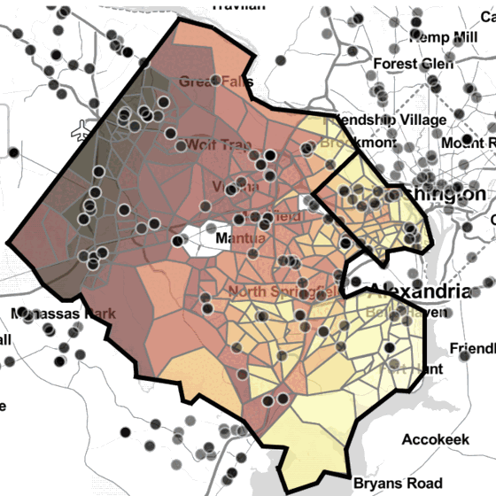
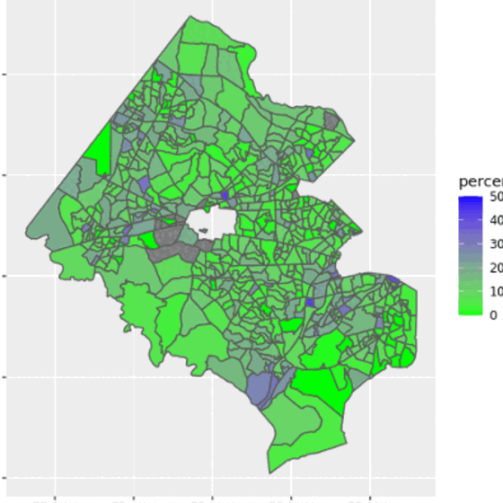
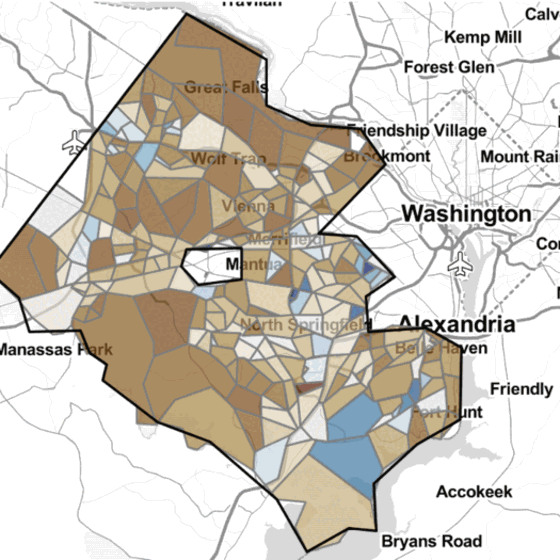

# Data stories

Each story starts with a question from a county partner and answers it with
several measures read together. No single measure settles any of these
questions; the pattern across them does.

  <article class="sdc-story">
    
    

      <h2><a href="broadband/">Is broadband a question of infrastructure or affordability?</a></h2>
      
Arlington and Fairfax Counties · 2019–2021

      <ul class="sdc-story__measures" aria-label="Measures triangulated">
        <li><i style="--swatch:#7fd1b9"></i>Download speed</li>
        <li><i style="--swatch:#2fa48e"></i>Household broadband adoption</li>
        <li><i style="--swatch:#1f6f8b"></i>Price of fast internet as a share of income</li>
        <li><i style="--swatch:#1d4f7a"></i>Race and ethnicity</li>
      </ul>
      
Speeds are above the broadband standard everywhere. The pockets of low adoption line up with the highest price-to-income ratios, so the gap is economic, not technical. Presented to both county boards.

      <a class="sdc-story__link" href="broadband/">Read the story</a>
    

  </article>

  <article class="sdc-story sdc-story--flip">
    
    

      <h2><a href="health-equity/">Is access to urgent care equitable?</a></h2>
      
Arlington and Fairfax Counties · 2022

      <ul class="sdc-story__measures" aria-label="Measures triangulated">
        <li><i style="--swatch:#7fd1b9"></i>Facility count</li>
        <li><i style="--swatch:#2fa48e"></i>Drive time to the ten nearest</li>
        <li><i style="--swatch:#1f6f8b"></i>Three-step floating catchment score</li>
        <li><i style="--swatch:#1d4f7a"></i>Median household income and demographics</li>
      </ul>
      
Counting facilities says Fairfax is well served. A population-aware catchment score shows southern Arlington, Annandale, Bailey's Crossroads, and Fort Hunt with both low income and low access.

      <a class="sdc-story__link" href="health-equity/">Read the story</a>
    

  </article>

  <article class="sdc-story">
    
    

      <h2><a href="business-diversity/">Do minority-owned businesses employ more minority workers?</a></h2>
      
Fairfax County · 2011–2020

      <ul class="sdc-story__measures" aria-label="Measures triangulated">
        <li><i style="--swatch:#7fd1b9"></i>Businesses by ownership and industry</li>
        <li><i style="--swatch:#2fa48e"></i>Employment by minority-owned businesses</li>
        <li><i style="--swatch:#1f6f8b"></i>Minority employment by block group</li>
      </ul>
      
Minority-owned businesses grew faster than businesses overall but stayed under a fifth of every industry. Block group by block group, their presence shows no correlation with minority employment.

      <a class="sdc-story__link" href="business-diversity/">Read the story</a>
    

  </article>

  <article class="sdc-story sdc-story--flip">
    
    

      <h2><a href="food-security/">How many households in Fairfax are food insecure, and where?</a></h2>
      
Fairfax County · 2022

      <ul class="sdc-story__measures" aria-label="Measures triangulated">
        <li><i style="--swatch:#7fd1b9"></i>Local cost of living by household type</li>
        <li><i style="--swatch:#2fa48e"></i>Households by income and size, fitted per tract</li>
        <li><i style="--swatch:#1f6f8b"></i>USDA low-cost food plan</li>
        <li><i style="--swatch:#1d4f7a"></i>SNAP access</li>
      </ul>
      
About one household in five is food insecure and one in four is at risk, with tracts ranging from none to more than half. The county-wide figure matches an independent survey; the tract-level map is new.

      <a class="sdc-story__link" href="food-security/">Read the story</a>
    

  </article>

The exhibits in these stories were produced for the original Social Impact
Data Commons dashboard. The same measures are available on the current
[National Capital Region dashboard](https://dads2busy.github.io/national_capital_region_data/).
